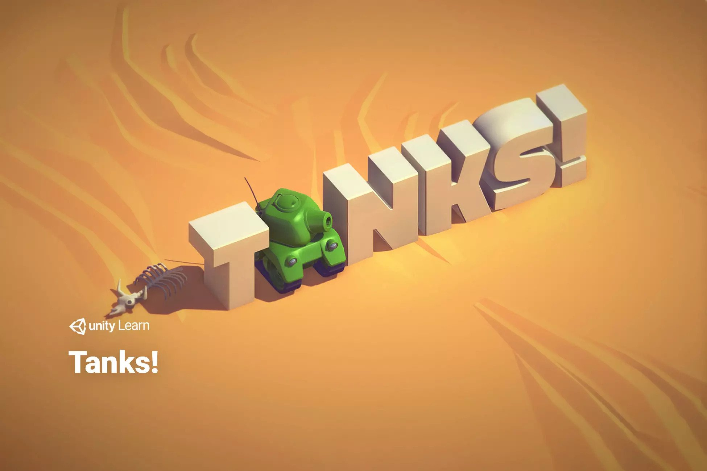
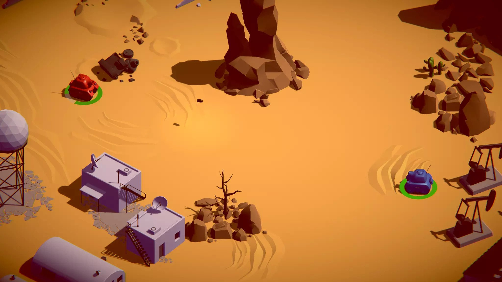
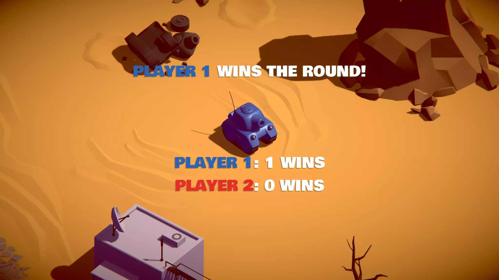

# IPSSI-WAR

**Jeu de combat de tanks 3D multijoueur en LAN — projet école IPSSI**

  

---

## Présentation

**IPSSI-WAR** est un jeu de duel de tanks 3D pensé pour l'arène : deux tanks, une map désertique, un objectif simple — *être le dernier debout*. Le jeu se joue en **LAN** (un host + des clients sur le même réseau) ou en **solo contre une IA**, dans des rounds rapides et nerveux.

> Projet réalisé dans le cadre d'un module à l'IPSSI. L'usage de l'IA était autorisé pour la production du code et des assets ; notre travail a porté sur la **conception**, la **direction artistique**, le **game design**, l'**intégration** et la **livraison** du jeu.

  

> Lien direct : <https://streamable.com/ynbe2e>

---

## Gameplay

- **Mode LAN** : un joueur héberge la partie, les autres rejoignent via découverte automatique du lobby ou par IP.
- **Mode Solo** : combat 1v1 contre un bot dont l'IA prédit la trajectoire de la cible et ajuste son tir.
- **Objectif** : réduire les PV de l'adversaire à zéro pour remporter le round. Best-of pour gagner la partie.
- **Contrôles** : déplacement clavier, visée à la souris avec curseur dédié, charge du tir maintenue puis relâchée.
- **Feedback** : marqueur de coup (hitmarker), vignette de dégâts, prévisualisation de trajectoire, sons d'engagement, ambiance désertique.

  
  

---

## Features

| Catégorie | Détails |
|-----------|---------|
| **Multijoueur LAN** | Hébergement / rejoindre, découverte automatique des parties, lobby live |
| **Solo vs IA** | Bot avec prédiction de tir, strafe, cooldown randomisé |
| **Power-ups** | Soin, Speed Boost, Cadence de tir, Boost de dégâts |
| **Pickups de soin** | Apparition régulière sur la map |
| **Personnalisation** | 8 couleurs de tank au choix avant la partie |
| **HUD** | Barre de vie, hitmarker, vignette de dégâts, crosshair souris |
| **Confort** | Réglage de sensibilité, prévisualisation de trajectoire |
| **Audio** | Mixage dédié (musique, moteur, tirs, explosions) |
| **Build** | Exécutable Windows + build Linux + installeur Inno Setup |

---

## Répartition du travail

Le projet a été mené à 3. Comme l'usage de l'IA était autorisé, nos rôles ont été organisés autour de la **conception**, du **prompting**, de l'**intégration dans Unity**, des **tests** et du **packaging** — pas autour d'une écriture manuelle ligne à ligne.

### Evan — Lead Tech & Réseau
- Architecture générale du projet et arborescence des scripts
- Mise en place du **multijoueur LAN** (Netcode for GameObjects, lobby, découverte UDP)
- Intégration des scripts de tank (mouvement, tir, santé) côté réseau
- Build & packaging : exécutable Windows, **installeur Inno Setup** (`IPSSI-WAR.iss`)
- Coordination Git et structure du dépôt

### Wael — Gameplay & IA
- Game design des rounds et équilibrage (PV, dégâts, cadence)
- **IA du bot** (prédiction de tir, strafe, cooldown) pour le mode solo
- Système de **power-ups** (soin, speed, cadence, dégâts) et pickups
- Tests gameplay, itérations sur le ressenti tank

### Mathis — UI / UX & Direction artistique
- Menus runtime (lobby, attente, sélection de couleur, écrans de victoire)
- **HUD** : barre de vie, hitmarker, vignette de dégâts, crosshair souris
- Prévisualisation de trajectoire et réglages de sensibilité
- Direction visuelle (palette, materials, ambiance), intégration audio (mixer)
- **Vidéo de présentation** du jeu

> Sur les phases denses, on a tous mis la main à la pâte (debug, tests réseau croisés, polish). La répartition ci-dessus reflète **qui pilotait** chaque axe.

---

## Démarrage rapide

### Jouer (build)
1. Récupérer le build dans la section **Releases** du dépôt.
2. Lancer `IPSSI-WAR.exe` (Windows) ou l'exécutable Linux.
3. **Host** une partie ou **Join** via découverte LAN / IP.

### Ouvrir le projet
- **Unity** (version du projet, voir `ProjectSettings/ProjectVersion.txt`)
- Ouvrir le dossier racine dans Unity Hub → *Add project* → *Open*.
- Scène de menu principale dans `Assets/Scenes/`.

---

## Stack

- **Unity** (3D URP)
- **C#** — scripts gameplay, UI, réseau
- **Unity Netcode for GameObjects** + **Unity Transport (UTP)** pour le LAN
- **Inno Setup** pour l'installeur Windows

---

## Crédits

| Membre | Rôle |
|--------|------|
| **Evan** | Lead Tech, Réseau, Build |
| **Wael** | Gameplay, IA, Power-ups |
| **Mathis** | UI/UX, DA, Vidéo |

Base 3D inspirée du *Tanks Tutorial* d'Unity Learn, étendue avec multijoueur LAN, IA, power-ups, customisation et menus custom pour donner naissance à **IPSSI-WAR**.

---

*Projet pédagogique — IPSSI*

